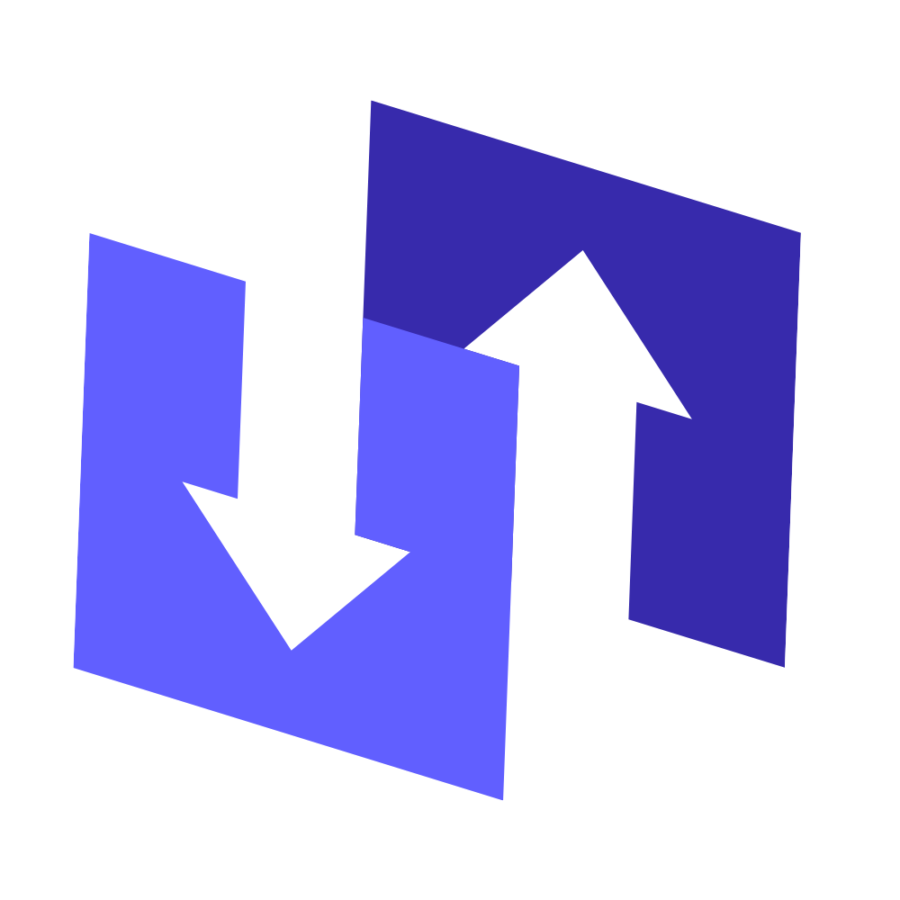

<p align="center">
  
</p>

<h1 align="center">Splibilo</h1>

<p align="center"><b>Track shared group expenses and settle up in the fewest payments possible.</b></p>

Splitting a trip, a flat, or a dinner ends the same way: a group chat full of
"who owes who" and a spreadsheet nobody trusts. Splibilo replaces that: log an
expense (or snap the receipt), and it tracks every balance and tells each person
the *shortest* set of payments that clears the group.

Full-stack: **NestJS** + **Next.js (App Router)** + **PostgreSQL/Prisma**.


## Quick Start

```bash
git clone https://github.com/andeluw/splibilo && cd splibilo

# Backend (NestJS, :8000)
cd backend
cp .env.example .env          # set DATABASE_URL + GEMINI_API_KEY
pnpm install
pnpm prisma migrate dev
pnpm db:seed                  # demo group + expenses
pnpm start:dev

# Frontend (Next.js, :3000) in a new terminal
cd frontend
cp .env.example .env
pnpm install
pnpm dev
```

Open http://localhost:3000. Requires PostgreSQL and Node 18+.

## Features

- **Settle in the fewest payments**: greedy debt-simplification (O(n log n)) turns a tangle of IOUs into a minimal "who pays whom" list.
- **Snap a receipt, skip the typing**: Sharp → Tesseract → Gemini pipeline extracts items, tax and total into a prefilled expense form.
- **Balances that are always right**: every expense/settlement recomputes net balances in real time; custom splits are floating-point-safe, updates are transactional.
- **Groups with real permissions**: invite by email or code, role-based access (Owner/Admin/Member), archive and lock.
- **See where the money goes**: trends, category breakdown, top payers, personal summary.
- **Secure by default**: JWT auth with refresh-token rotation, membership-enforced routes, 90%+ backend test coverage.

## Screenshots

**Your groups**: every shared group, your balance in each, filter by category.


**Group overview**: balances, spend-over-time, category breakdown, top payers.


**Add an expense**: split equally or per person, attach a receipt, or prefill it from receipt OCR.


**Settlements**: what has actually been paid back, and record new transfers.


**Your activity**: your position across every group, trends, recent expenses and settlements.


## How It Works

**Balance** per member:

```
net = totalPaid - totalOwed + settlementsReceived - settlementsSent
```

**Debt simplification**: separate creditors/debtors, sort by balance, greedy
two-pointer match. O(n log n), minimal transaction count.

**OCR pipeline**: Sharp (preprocess) → Tesseract.js (text) → Gemini (structured
JSON: items, subtotal, tax, total) → prefilled expense form.

## Tech Stack

**Frontend**: Next.js 15, React 19, Tailwind v4, Shadcn UI, TanStack Query, Zustand, React Hook Form, Recharts

**Backend**: NestJS 11, Prisma, PostgreSQL, JWT (refresh rotation), Multer + Sharp, Tesseract.js + Gemini, Nodemailer

## Purpose

Built to replace spreadsheets and "who owes who" chats with automated, transparent,
fair settlement. A full-stack study in transactional data integrity, algorithmic
optimization, and an OCR + LLM extraction pipeline.
